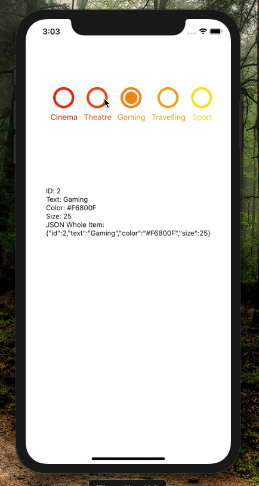

[](https://github.com/WrathChaos/react-native-animated-radio-button-group)


[](https://github.com/WrathChaos/react-native-animated-radio-button-group)


[](https://www.npmjs.com/package/react-native-animated-radio-button-group)
[](https://www.npmjs.com/package/react-native-animated-radio-button-group)

[](https://opensource.org/licenses/MIT)
[](https://github.com/prettier/prettier)

<p align="center">
  
</p>

# Installation

Add the dependency:

```ruby
npm i react-native-animated-radio-button-group
```

## Peer Dependencies

###### IMPORTANT! You need install them

```js
"react": ">= 16.x.x",
"react-native": ">= 0.55.x",
"react-native-animatable": ">= 1.3.3",
"react-native-animated-radio-button": ">= 0.0.4"
```

# Usage

## Import

```js
import RadioButtonGroup from "react-native-animated-radio-button-group";
```

## Usage

Data is just an example, you can customize **each** radio button with data itself. Example; you can set fontSize, innerColor, outerColor for each of them. They take all props which is available on [React Native Animated Radio Button](https://github.com/WrathChaos/react-native-animated-radio-button).

```jsx
const data = [
  { id: 0, text: "Cinema", color: "#FF0004", size: 25 },
  { id: 1, text: "Theatre", color: "#FB4009", size: 25 },
  { id: 2, text: "Gaming", color: "#F6800F", size: 25 },
  { id: 3, text: "Travelling", color: "#F4A012", size: 25 },
  { id: 4, text: "Sport", color: "#F0E017", size: 25 }
];

<RadioButtonGroup
  initial={2}
  data={data}
  onChange={item => setItem(item)}
/>
```

# Configuration - Props

| Property |     Type     |  Default  | Description                                                                          |
| -------- | :----------: | :-------: | ------------------------------------------------------------------------------------ |
| initial  |    number    |     0     | default selection of the radio button group                                          |
| data     | Object Array |   null    | creates and customize each radio button for the group                                |
| onChange |   function   | undefined | you can make your business logic or get the selection of the data from this function |
| onPress  |   function   | undefined | onPress function for each of them                                                    |

## Future Plans

- [x] ~~LICENSE~~
- [ ] TypeScript Challenge!
- [ ] Write an article about the lib on Medium

# Change Log

Change log will be here !

## Author

FreakyCoder, kurayogun@gmail.com

## License

React Native Animated Radio Button Group is available under the MIT license. See the LICENSE file for more info.
